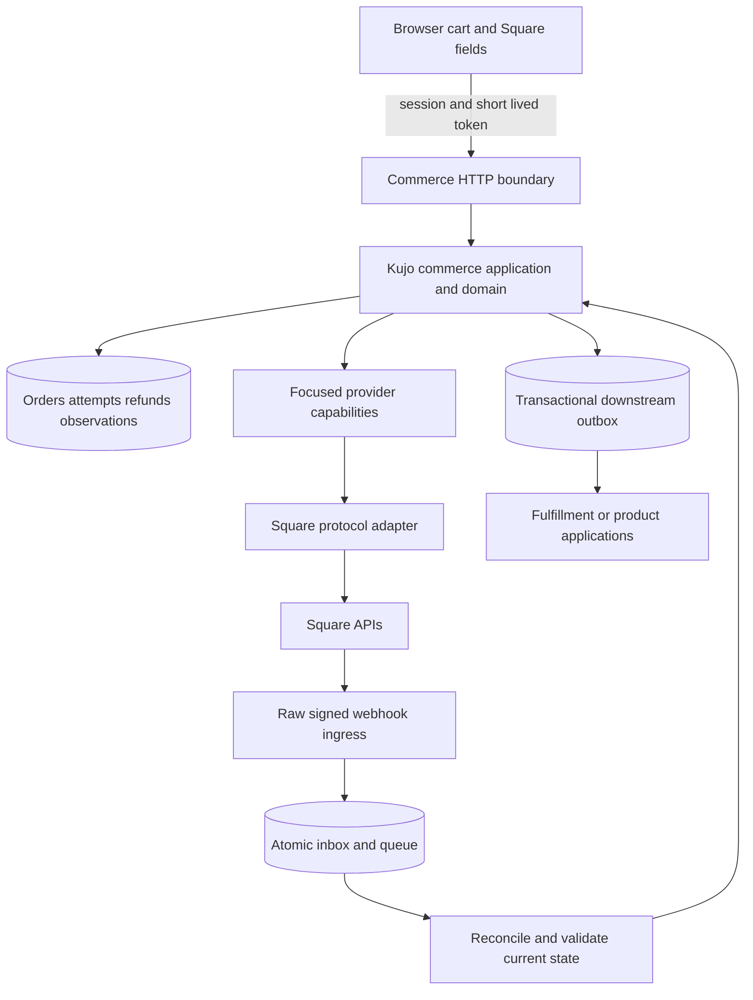
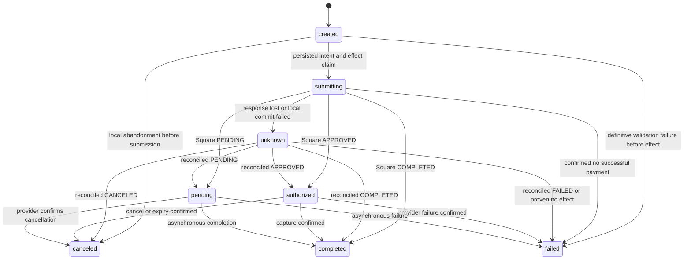

# Square integration architecture review

Reviewed October 7, 2026. Status: architecture recommendation, not an implementation or production-readiness claim. Repository baseline: `kujolang/commerce` at `d0884c5e5ec2de5da57086ec0709d7bca34dcfee` on `main`.

## 1. Executive recommendation

Extend the existing Square adapter with a small direct-payments capability and an optional durable commerce domain. Keep hosted checkout available. Do not replace Commerce with Square's object model, create another Square adapter from scratch, or move merchant payment collection into Kujo Payments.

The brief differs materially from the repository. Commerce already supports Square Payment Links, customer lookup/creation, saved cards, direct subscriptions, subscription cancellation/pause/resume, HMAC verification, and subscription retrieval. Conversely, Commerce explicitly says providers own orders, inventory, payments, and fulfillment. Its named payment/refund contracts are identifiers, not implemented aggregate models. A Kujo-owned order/payment domain is a deliberate new adoption level, not an adapter-only change. Preserve existing static and provider-managed workflows while adding opt-in local commercial intent, payment attempts, refunds, projections, and audit history.

Square remains authoritative for what its payment network actually did. Kujo owns what was ordered, the agreed amount, authorization to act, the local identity, and the application of verified observations. A local record cannot declare a charge successful merely because the application wanted it to succeed.

Recommended sequence:

1. Repair existing event-contract and idempotency defects and establish transaction/scoping guarantees.
2. Add the provider-neutral payment/refund domain and durable operation boundary.
3. Complete hosted-checkout correlation and payment/refund recovery using the existing adapter.
4. Add Sandbox embedded card checkout, direct Payments API operations, and full/partial refunds through that same boundary.
5. Harden the existing saved-card/subscription features; add optional invoicing and wallets based on demand.
6. Ship OAuth before distributing one centrally operated integration to unrelated sellers; application fees follow verified multi-merchant operations and commercial review.

The proposed v1.1 hosted checkout and v1.2/v1.4 cards/subscriptions are already partially implemented. Release numbers should follow accepted capability gates, not the brief's provisional numbering. No provider calls, credentials, or payment implementation were added by this review.

Square's release index identifies **2026-09-16** as latest at review time; its release lists **Node.js SDK 46.0.0**. That matches Commerce's existing API pin. The same release retires Transactions API mutations: use Payments and Refunds, not legacy Charge/CreateRefund operations. [Square release](https://developer.squareup.com/docs/changelog/connect-logs/2026-09-16), [release index](https://developer.squareup.com/docs/changelog/connect).

## 2. Existing architecture and repository evidence

Paths in this section are relative to the named repository. They identify inspected source, not proposed files.

| Repository and inspected revision | Actual role and relevant source |
| --- | --- |
| `kujolang/commerce`, `d0884c5` | JavaScript ESM package `@kujolang/commerce`, package version 0.4.0 plus Unreleased work. Node >=20 for development; runtime uses Request/Response/fetch/Web Crypto. `package.json`, `src/index.mjs`, `runtime/index.mjs`. Only runtime package dependency is `yaml`; `pg` is a development dependency, with a caller-supplied pool in the adapter. |
| `kujolang/payments`, `ea2f224` | Kujo 1.4-compatible buyer-side agent purchase executor; SQLite, Ability contracts, a synthetic-tested Stripe Link adapter. `src/providers/contract.kujo`, `src/application/execution.kujo`, `src/providers/link/submission.kujo`, `src/providers/link/payment_journal.kujo`. Its prepare/authorize/submit/observe model is useful precedent, not the seller interface. |
| `kujolang/dispatch`, `e1bbc21` | Kujo orchestration and effects. `src/adapters/sqlite_effect.kujo` binds a unique scope/key and intent in one transaction; `sqlite_effect_apply_checked` revalidates while holding the sink writer transaction. This cannot transact atomically with an external Square API. |
| `kujolang/ability`, `bcbecb4` | Kujo operation contracts and authorization binding: `src/contract.kujo`, `src/runtime.kujo`. Optional operator integration; no reason to require this runtime for browser checkout. |
| `kujolang/ssg`, `323e5e5`; `kujolang/site-kit`, `4a28746` | Static generation and presentation. Commerce's `src/pipeline.mjs` invokes the unmodified SSG. `commerce/AGENTS.md` explicitly keeps provider and cart concepts out of SSG. |
| Ashford Commerce, `d923676` | Separate Node 24 ESM application at `/Users/robertdevore/2026/ashford-commerce`. `src/providers/square/client.mjs`, `src/application/subscribe.mjs`, `webhooks.mjs`, `reconciliation.mjs`, `recovery.mjs`, `public/checkout.js`, and SQLite/PostgreSQL migrations already demonstrate an embedded subscription service, local billing state, event recovery and signed product events. Its `AGENTS.md` forbids moving Ashford/QuoteFlow seller policy into generic Kujo. |
| Revenue Desk, `53db0f6` | Kujo-native opportunity/front-desk app at `/Users/robertdevore/2026/revenue-desk`. README and runtime inventory show SQLite, provider-neutral interaction boundaries, RAG and eval tooling, not a merchant billing domain. Reuse collection/invoice service contracts rather than importing Node browser packages into Kujo. |
| QuoteFlow integration | Inspected from Ashford's `contracts/ashford-quoteflow-entitlement.v1.json`, `scripts/run-quoteflow-vertical-slice.mjs`, lifecycle harness, and `docs/JOINT_QUOTEFLOW_LAUNCH.md`. A standalone QuoteFlow checkout was not located in the searched local roots; no claim is made about its current internal implementation. The available contract separates billing observations from product authorization/provisioning. |

`commerce.robertdevore.com` is a consumer/documentation site, not the package implementation. Alternate review/worktree directories such as `kujo-payments-review` are not separate canonical provider packages. Agents SDK and AI SDK are adjacent agent/model tooling, not necessary payment dependencies. No Kujo compiler/runtime dependency is imported by Commerce's Web runtime; only its optional SSG build wrapper executes `kujo`.

### Concrete contracts and behavior

| Area | Existing implementation | Consequence |
| --- | --- | --- |
| Product, variant, price | `src/pipeline.mjs`: `loadProducts`, `validateStore`, `buildCatalog`; Markdown commerce frontmatter; stable SKU/product/variant IDs; `src/money.mjs` exact integer minor units | Real local presentation/offer definitions exist. They are not inventory reservations or a transactional order ledger. |
| Cart and checkout | `browser/cart-core.js`, `browser/commerce.js`; `runtime/index.mjs:checkoutHandler` resolves SKU/quantity against trusted catalog | Browser amounts/provider IDs are not accepted as payment authority. Square still prices catalog-backed Payment Links remotely. |
| Providers | `src/providers.mjs:createProviderRegistry`; plain objects, no language traits/classes required | Required methods are config/product validation, public product projection, checkout/completion, webhook config/verification/normalization. Optional methods and boolean capabilities already exist. |
| Square | `src/providers/builtins.mjs:squareProvider` | `/v2/online-checkout/payment-links`, Customers, Cards, Subscriptions, catalog existence check; no CreatePayment, capture, payment cancellation, RefundPayment, OAuth or invoice creation. `direct_reconciliation` only covers subscriptions. |
| Contracts | `src/contracts.mjs:CONTRACT_SCHEMAS`, `providerReference`, `createConsentEvidence`; `schemas/*.json` | Payment/refund schema names alone do not supply validated records, transitions or persistence. Existing provider reference lacks connection/merchant scope. |
| Offer snapshots | `src/revisions.mjs:createOfferRevision`, immutable revision store | Reuse canonical money/terms/provider-mapping snapshots; wire them into every new attempt. |
| Operation state | `src/idempotency.mjs:executeProviderOperation` | Persists intent and key; distinguishes unknown result. Memory fixture and PostgreSQL implementation differ in concurrency details. Neither is a complete payment executor. |
| Durable ingress | `runtime/index.mjs:durableWebhookHandler`; `adapters/postgres.mjs:ingress.claimAndEnqueue` | PostgreSQL atomically inserts receipt and queue job. Prefer this over separate receipt/queue calls. |
| Worker and downstream | `src/durability.mjs:processNext`; `src/downstream.mjs`; `src/operator.mjs` | Leases, bounded retries, dead letters, replay, signed outbox and operator hooks exist. Application transition and outbox insertion still need a shared transaction. |
| HTTP hosts | `runtime/node.mjs`, `cloudflare.mjs`, `vercel.mjs`, `netlify.mjs` | Preserve portable Web API handlers. Node bridge supports a body limit, defaulting to Infinity; deployments must set bounds. |
| Configuration | `src/config.mjs` loads exactly one `kujo-commerce.yml`, `.yaml` or `.json`; provider-specific `_env` indirection | Keep public configuration separate from deployment credentials. |
| Tests and CLI | Node tests, AJV, Playwright; `bin/kujo-commerce.mjs` | Actual CLI is `kujo-commerce init/build/validate/doctor/providers/verify/provider verify`. There is no `kujo commerce square connect` command. |

The inspected README, architecture, compatibility, production-backend, Square, failure-recovery and staging documents consistently preserve optional static operation. The repository's GitHub issue query (`gh issue list --repo kujolang/commerce --state all --limit 50`) returned no issues. This does not establish the absence of private or external planning.

## 3. Gap analysis and confirmed review findings

| Capability needed | Existing foundation | Required delta |
| --- | --- | --- |
| Kujo-owned orders/payments | Catalog, cart, offer revisions, contract identifiers | Opt-in validated aggregates, payment attempts/refund ledger and transactional repositories |
| Direct embedded payment | Saved-card adapter method, no generic card browser flow | SDK UI, authenticated checkout session, amount revalidation, Create/Get/Cancel/CompletePayment |
| Recoverable refunds | Refund notifications only | Authorized refund commands, persisted key, reservation against refundable balance, Get/List refunds |
| Unknown-result recovery | Operation states, subscription retrieval | Payment/order/link correlation, bounded scans and quarantine when absence is unproven |
| Durable transitions | Atomic PostgreSQL ingress and outbox primitives | Tenant/environment scoping, fenced workers, transaction joining domain change/receipt/outbox |
| OAuth | Global access-token environment lookup | Optional connection records, encrypted credentials, state callback, refresh/revocation lifecycle |
| Application fees | None | Deferred policy and accounting module; reserve extensible operation metadata without enabling fees |

Two defects were reproduced entirely offline against the baseline; see [review evidence](square-review-evidence.md):

**F1 — normalized Square events violate the frozen event schema.** `payment.updated` with PENDING, `refund.updated`, `invoice.payment_made`, and `dispute.created` normalize to enum values absent from `schemas/event.schema.json`. AJV rejects all four. `test/schema.test.mjs` compiles schemas and rejects malformed samples, but does not validate every real adapter event. Extend the permitted enum values under the documented additive policy and cover each event fixture before consumers rely on them.

**F2 — different accepted attempts can share a Square idempotency key.** `operationKey` strips characters and truncates to 45 characters. Two checkout IDs sharing 45 prefix characters emit the same provider key. `subscriptionHandler` truncates `kujo-${operationId}` similarly. This can cause an unrelated attempt to receive a prior result or a provider conflict; it is not evidence of a duplicate live charge. Generate an opaque short key once per persisted scoped operation, or use a domain-separated digest; never truncate a user-controlled identity to obtain uniqueness.

Additional source-observed integration gaps, not claims of independently exploited vulnerabilities:

- Hosted checkout bypasses `executeProviderOperation`, accepts an optional client attempt ID and otherwise creates a random key. It stores neither immutable intent nor returned Square order mapping. A retry after process loss is therefore not generically recoverable.
- Normalized v1 events discard merchant, location, amount, payment status and object version. `payment.created` becomes `commerce.order.created`, even when payment is pending. These notifications are wake-up hints, not fulfillment authorization. A separate verified observation envelope must retain required routing/evidence.
- Receipt primary keys are only `provider_event_id`; operations only `operation_id`; cursors are provider/kind scoped. These are not ready-made shared multi-tenant tables. Scope by connection and environment, and bind merchant identity after signature verification.
- The fallback `receiptStore.claim` then `queue.enqueue` path can strand a claimed receipt if enqueue fails; a subsequent duplicate during its lease can be acknowledged without a queued job. The PostgreSQL atomic ingress avoids this gap.
- Generic `webhookHandler` can return 202 before delivery when `waitUntil` is used. Only durable ingress is suitable for new money-moving functionality. `processNext` does not atomically couple a caller's business change with receipt completion and outbox append.
- Generic convergence coerces versions with `Number`. Square payment `version_token` is opaque, unlike numeric subscription versions. Use typed provider evidence and refetch conflicts rather than comparing tokens numerically.
- `verifyRemote` checks a Square catalog object's deletion/existence, not expected price, currency, variation type or location eligibility. A remotely changed catalog price can diverge from displayed local money.
- Raw-body comparison is a hand-written JavaScript equal-length XOR loop. It avoids early exit on content differences but is not a portable guarantee of constant-time execution. Prefer native cryptographic verification.

These are implementation prerequisites, not a reason to rewrite unrelated providers or Kujo runtime components.

## 4. Proposed architecture and checkout modes



Keep protocol code in `commerce/src/providers/square/` after a behavior-preserving split of the monolithic `builtins.mjs`. Keep order/payment orchestration in a separate opt-in `src/payments/` or similarly focused module, with Web-compatible exports. The static import path must not initialize persistence, SDKs, background jobs or credentials.

For JavaScript consumers, an optional Commerce subpath can expose payment collection without the catalog builder. For Kujo-language consumers, expose a small authenticated service contract or later a Kujo-native protocol package. Do not import the buyer-side Payments executor as a seller backend. Extract a separate generic Square package only when two maintained consumers need the same protocol implementation and its tests can move with it. Ashford is a useful reference consumer; its tax, price, entitlement and seller policy remain there.

### Hosted checkout

Retain the existing dynamic creation of a Square-hosted Payment Link. Square can also create quick-pay/ad-hoc links and supports its own subscription checkout; Commerce currently implements catalog-backed one-time links and rejects subscription items in `createCheckout`. Preserve the returned link ID **and order ID**, plus the local checkout/operation association. A redirect only displays progress; fulfillment requires verified state. [Checkout API](https://developer.squareup.com/docs/checkout-api).

Use one local checkout session with one active payment route. If embedded checkout becomes uncertain, do not silently fall back to hosted checkout: first prove the earlier operation cannot settle or keep the session locked for reconciliation. Disable/retire links when switching routes where supported; a reusable or still-open remote link must not be mistaken for a single-use local payment attempt. Enforce paid-order checks and review additional remote payments.

### Embedded checkout

Render only application ID, location ID, environment, server-calculated money and short-lived session context. Load `https://sandbox.web.squarecdn.com/v1/square.js` in Sandbox, `https://web.squarecdn.com/v1/square.js` in production. Square owns sensitive entry fields. Call `card.tokenize(verificationDetails)` using the server's amount/currency and correct CHARGE/STORE intent; the current flow integrates buyer verification, while `verifyBuyer()` is deprecated. Send only the resulting token to the server. [Card flow](https://developer.squareup.com/docs/web-payments/take-card-payment), [deployment](https://developer.squareup.com/docs/web-payments/quickstart/deploy-app).

The server revalidates session ownership, expiry, offer revision, merchant connection, currency, exact total and existing payment before submission. Payment source tokens are transient secrets: never put them in attempts, logs, URLs, queues, traces or browser storage. Order/attempt creation happens before the external effect. A success API response and later webhooks both enter the same observation reducer.

Use proposed `checkout.mode: hosted | embedded` for **presentation**, with hosted as the compatibility default. Existing `dynamic_checkout` means a runtime-created checkout, not embedded payment fields; existing provider-specific `checkout_mode: hosted | dynamic` values must keep their meaning. New schema fields and exports require compatibility tests and changelog entries.

| Method | Square support and proposed enablement |
| --- | --- |
| Credit/debit cards | First embedded milestone; support SCA success, challenge, cancel and verification-required outcomes. |
| Apple Pay | Later browser capability; register/verify the production domain and test supported devices. |
| Google Pay | Later browser capability; check browser/wallet availability and merchant configuration. |
| ACH | US-only; asynchronous payment state, separate authorization UX, no assumption of card-like capture or recurring saved bank accounts. |
| Cash App Pay | US-only; separately test redirect/mobile return and cancellation. |
| Square Gift Cards | Separate funding source; balance and insufficient-funds behavior, not a stored credit card. Do not infer split-tender support from basic payments. |
| Afterpay/Clearpay | Country/amount/merchant eligibility gates; Australia, Canada, UK and US in the current country table. Do not declare generic card capture semantics. |

Square lists these Web SDK families; availability is evaluated by seller country, method and browser, not a global true/false flag alone. [Web SDK](https://developer.squareup.com/docs/web-payments/overview), [country support](https://developer.squareup.com/docs/payment-card-support-by-country).

### SDK choice

Keep direct HTTP for the first change. It matches current injected `fetch`, Web Crypto and edge portability, and isolates the exact endpoints needed. The official Node SDK is suitable for a Node-only host: version 46.0.0 targets API 2026-09-16, requires Node >=18, and provides async clients. `npm view square` reported 12,046,575 unpacked bytes and dependencies including `square-legacy`, `node-fetch`, form-data libraries and streams; this is package size, not measured browser bundle size. Commerce does not currently need that full surface.

The SDK was substantially rewritten at version 40; do not copy pre-40 initialization/error examples into a new integration. If adopting it later, pin it, disable or constrain hidden mutation retries, normalize BigInt/money at the boundary, and test Worker/Node behavior explicitly. Direct HTTP needs bounded parsing, strict origin/redirect policy, error normalization, version headers and recorded protocol fixtures. [SDK migration](https://developer.squareup.com/docs/sdks/nodejs/migration), [release version](https://developer.squareup.com/docs/changelog/connect-logs/2026-09-16).

## 5. Focused provider interfaces and durable operations

Retain the registry's existing mandatory contract. Add opt-in structural capability objects or optional methods, validated when advertised. The following are design signatures, not currently exported APIs:

```text
PaymentCollection.createPayment(intent, transientSource, connection, effect)
PaymentCollection.getPayment(reference, connection)
Refunds.createRefund(intent, connection, effect)
Refunds.getRefund(reference, connection)
DelayedCapture.capturePayment(reference, expectedVersion, connection, effect)
DelayedCapture.cancelPayment(reference, connection, effect)
HostedCheckout.createCheckout(intent, connection, effect)
Reconciliation.listPayments/listRefunds/retrieveObject(...)
ProviderConnections.authorize/completeCallback/refresh/disconnect(...)
```

Authorization is `createPayment` with an explicit manual-capture intent; a public `authorizePayment` convenience method need not duplicate the protocol. Customer/cards, subscriptions, invoicing, catalog/inventory and in-person operations are separate optional modules. Keep webhook verification and parsing distinct from database writes and business transitions.

New boolean capabilities can include `payment_collection`, `refunds`, `delayed_capture`, `embedded_checkout` and `invoicing`. Preserve `refund_events` as notification support, not refund mutation support. Add a server-side resolver for effective capabilities given seller country, scopes, location, method and environment. Existing `inventory: true` is not proof of local stock synchronization. Deny unavailable features before creating an effect.

### Durable records and execution

Use a composite scope `(merchant_id, connection_id, environment)` for every operation, external reference, cursor and receipt. Persist a UUID-sized provider idempotency key **once** with the operation; enforce unique `(scope, operation_type, key)`. A UUID is 36 characters and fits Square payment's 45-character limit. Never use the same logical key for different operations, merchants or revisions. Hash canonical intent separately to reject changed requests.

An operation records local payment/refund ID, attempt ID, immutable intent digest, provider key, API version, state, retry policy, observed provider IDs and safe request ID. Intent covers amount, currency, location, order revision, capture mode, customer binding and any future approved fee policy. The source token is excluded; the authenticated browser's retry must not create a second operation.

Before the network call, transactionally claim the operation with a fencing generation and revalidate its frozen intent. Persist submission state before releasing the transaction. Never hold a database transaction open across Square I/O. A losing/stale worker cannot commit a result. Network delivery remains at least once; provider idempotency plus local transactional transitions provides one effective logical action, not universal exactly-once transport.

### Mutation retry inventory

This inventory covers existing and proposed Square mutations in this review. It is deliberately endpoint-specific; a future endpoint is unsupported until its own retry contract is recorded. Read/list/search calls can be retried with bounds even when their HTTP method is POST.

| Mutation family | Safe retry rule |
| --- | --- |
| CreatePayment, including authorization | Persist `idempotency_key`; reuse exact intent and original source when still available. A timeout is unknown, not a decline. Never substitute a freshly tokenized source under an uncertain existing effect. |
| RefundPayment | Persist a separate refund key, payment ID, money and expected payment version. Reuse unchanged request; reserve pending/unknown refunds locally to prevent over-refunding. |
| CreatePaymentLink | Persist key and frozen order input; recover link/order association. Existing random fallback is unsuitable for durable mode. |
| CreateCustomer, CreateCard, CreateSubscription | Persist distinct keys; exact consent/customer/plan binding. Token-dependent CreateCard has the same crash recovery constraint as CreatePayment. |
| CreateOrder, UpdateOrder, PayOrder | Use documented idempotency support and current order version where required. Freeze the tender/payment-ID set for PayOrder; do not call it after an unrelated direct capture as a second payment action. |
| CreateInvoice, UpdateInvoice, PublishInvoice | Persist keys where supported even when optional; preserve invoice version. Creation and publication are separate effects; publication can send mail or charge a saved card. [PublishInvoice](https://developer.squareup.com/reference/square/invoices-api/publish-invoice). |
| Catalog Upsert/BatchUpsert, Inventory BatchChange | Durable key per frozen batch, catalog versions and inventory occurrence timestamps; replay the same batch, not a new adjustment. [Catalog batch](https://developer.squareup.com/reference/square/catalog-api/batch-upsert-catalog-objects), [inventory batch](https://developer.squareup.com/reference/square/inventory-api/batch-change-inventory). |
| CompletePayment, CancelPayment | Resource/state-based commands, not generic new-key create operations. Retrieve after uncertain response; verify desired terminal state and concurrency version before bounded retry. [Delayed capture](https://developer.squareup.com/docs/payments-api/take-payments/card-payments/delayed-capture). |
| CancelPaymentByIdempotencyKey | Uses the **original creation key** when payment ID is unknown. A successful empty response can mean no matching payment; it is not proof of a refund or a general durable fence against an in-flight late creation. [Cancellation reference](https://developer.squareup.com/reference/square/payments-api/cancel-payment-by-idempotency-key). |
| DisableCard, DeleteCustomer, DeletePaymentLink; subscription cancel/pause/resume; invoice cancel/delete | No blanket key guarantee. Record desired state, serialize per resource, retrieve after uncertainty, and retry only when the endpoint/state contract permits. Scheduling actions need action-list inspection to avoid repeated schedules. |
| OAuth code exchange, refresh, revoke | Not payment idempotency operations. Codes are one-use; do not endlessly replay a consumed callback. Serialize refresh and atomically replace credentials; reconcile revoke outcomes without claiming remote revocation from local deletion. |
| Terminal checkout/refund, device pairing, dispute evidence/acceptance, other future mutations | Disabled/deferred. Add endpoint-specific command records and conflict rules before enabling; do not inherit payment retry policy by HTTP verb. Payouts are reporting inputs here, not a transfer executor. |

After a process crash, the original payment token will intentionally be unavailable. There is no general GetPayment-by-idempotency-key endpoint. Recovery must use previously stored payment/order/link IDs, a server-set correlation reference and bounded list/event scans. If no unambiguous match exists, keep `unknown` and require repair; do not ask the buyer to create another charge. This is a required test and operational path, not an edge case to hide behind retries.

## 6. Domain ownership and provider mapping

| Kujo entity | Authority and Square reference |
| --- | --- |
| Merchant | Application's merchant ID; optional `ProviderConnection` contains Square merchant ID, environment and location(s). No Square identity in the canonical merchant key. |
| Product / variant | Local product ID and SKU; optional CatalogItem/CatalogItemVariation mapping by published revision. |
| Price / offer | Immutable exact money, quantity/tax/discount policy and terms version; Square catalog/version mapping is external execution data. |
| Cart | Local proposed SKU/quantity selection; server reprices and creates an order snapshot. |
| Order | New local order ID, immutable line items/totals and independent order lifecycle; optional Square Order ID. |
| Fulfillment | Application-owned shipment/service/provisioning policy; optionally mirrored to Square fulfillment objects. Payment events alone do not ship or grant access. |
| Customer | Local identity with verified account binding; scoped Square Customer mapping. Email alone is not cross-tenant identity proof. |
| Inventory | Local availability is currently only a presentation flag. A future stock ledger/reservation system is application/Kujo-owned by default; optional Square projection. |
| Payment | Local ID/order relationship/attempt history; Square payment ID, method, status observation, exact authorized/captured money, update time, opaque version token and processing-fee observations. Square decides settlement facts. |
| Refund | Local independently authorized request and status ledger; Square refund ID/payment ID and external refund order ID. Preserve audit history. |
| Subscription | Local enrollment/consent/product relationship; Square subscription and plan variation references plus observed billing lifecycle. Active enrollment alone is not proof the latest invoice was paid. |

Proposed local tables: merchants (or application-supplied identity), provider_connections, orders/order_lines, payments, payment_attempts, refunds, external_references, provider_observations, inbox, operations and outbox. Reuse existing offer/operation/receipt/outbox concepts instead of introducing parallel stores. A new payment record should hold minor-unit amount/currency, capture state, refunded/pending-refund totals, method type, timestamps and optimistic local version. Keep refund and dispute lifecycles separate from payment status. Do not persist full Square responses by default.

### Square Orders

Do not require an explicitly created Square Order for every Kujo order. Direct payment-only collection can omit a supplied order ID; Square can create its own payment association. Hosted Payment Links and invoices do involve Square Orders. Create a rich Square order when merchant dashboard itemization, tax/discount reporting, fulfillment integration or inventory changes justify it. Keep the local order ID canonical and place a bounded correlation in supported reference fields. [Orders overview](https://developer.squareup.com/docs/orders-api/what-it-does).

Catalog-backed items provide Square's variation/modifier/price semantics but create drift coupling. Ad-hoc items let Kujo send trusted names and unit prices without requiring a Square catalog. Select one tax/discount calculation authority per flow; record the quoted and provider-returned totals and reject unexplained differences. Model modifier selections, customer references, shipping/pickup and discounts explicitly; do not expect the current SKU/quantity-only request to convey them. Dashboard visibility differs by order/payment/fulfillment flow and requires acceptance tests. Refund order references describe returns, not a replacement canonical order.

### Catalog and inventory strategies

| Strategy | Recommendation and conflict rule |
| --- | --- |
| Kujo authoritative to Square | Default for the new owned-domain mode. Versioned outbox exports optional catalog projections. Detect remote edits and report drift; do not overwrite published intent silently. |
| Square authoritative to Kujo | Optional explicit import connector for merchants already operating Square POS. Imported revisions retain source/provenance; core can still operate without this connector. Stock authority must be chosen per location. |
| Bidirectional | Defer. Requires per-field ownership, mapping/version checks, sync-loop suppression, deletion tombstones and a conflict queue. Last arrival wins is unsafe for price and stock. |

`catalog.version.updated` is a signal to retrieve changed catalog objects; it is not a complete local product replacement. `inventory.count.updated` supplies variation/location/state counts. Reconcile counts by provider calculation time and retrieve current state for conflicts; do not subtract stock twice because both a payment and an inventory webhook arrived. Local reservations need their own concurrency rule. [Catalog webhooks](https://developer.squareup.com/docs/catalog-api/webhooks), [inventory webhooks](https://developer.squareup.com/docs/inventory-api/webhooks).

### Customers and cards

Reuse existing customer/card calls but separate storage consent from recurring consent: the current `createSavedPaymentMethod` requires both, making it narrower than a general one-time saved-card feature. Add list/retrieve/disable methods only with authenticated customer binding. Store provider card ID, customer mapping, brand, last four, expiry and consent provenance. Square can automatically update cards and emits card lifecycle events. Never persist PAN/CVV, SDK source tokens or verification tokens. [Cards API](https://developer.squareup.com/docs/cards-api/overview).

Customer deletion and provider disconnect are separate operations. A local unlink must stop future use; disabling a card or deleting a Square profile needs an explicit authorized policy because other Square workflows can use them. Reconcile disabled/automatically updated cards. Keep legally required payment audit records with minimized personal information; do not promise that deleting a customer erases historical transactions. Shared cards across sellers are a separate capability and are not enabled by the proposed default mapping.

### Subscriptions and invoices

Keep subscriptions as an optional module, already partially shipped. Square plans and plan variations live in Catalog; enrollment binds a customer and optional saved card. Without a card, billing can use emailed invoices. Recurring ACH through Subscriptions is not supported. Relative-price phases need order templates; generic Commerce currently restricts its advertised implementation to monthly static pricing. Preserve pause/resume/scheduled cancellation semantics and reconcile actions/invoices, including Dashboard changes. [Manage subscriptions](https://developer.squareup.com/docs/subscriptions-api/manage-subscriptions), [subscription billing](https://developer.squareup.com/docs/subscriptions-api/subscription-billing).

Add invoicing as reusable collection capability after the payment ledger, without importing quote or CRM models. An approved QuoteFlow quote or Revenue Desk business action can pass a trusted collection intent to the service; the application retains quote approval and customer authorization. Square invoice creation refers to an order and customer; publishing is a distinct effect. Support draft, publish, retrieve, cancel and observed partial/full payment before advanced scheduling. Deposits and payment schedules are supported, but installments require Invoices Plus and method-specific restrictions apply. Subscription-generated invoices should be observed rather than recreated. [Invoices](https://developer.squareup.com/docs/invoices-api/overview).

## 7. Payment and refund state machines

Separate the external payment state, the local effect state, and the order's fulfillment state. Do not represent a transport timeout as a failed charge.



Created/submitting/unknown are local execution conditions. APPROVED, PENDING, COMPLETED, CANCELED and FAILED are observed Square payment states. A pre-submission local cancellation/failure has no provider payment reference and must retain that distinction in its audit. Capture/cancel commands have their own submitted/unknown states while the last known payment remains authorized. A timeout must not erase the last authoritative payment fact. Unknown enum values go to operator review, not success.

For delayed card capture use `autocomplete=false`. Square's default limits are 36 hours card-present and seven days card-not-present. Store `delayed_until` and delay action; default to cancellation and schedule reconciliation before expiry. `CompletePayment` can use the opaque version token for optimistic concurrency. Do not assume capture windows or partial-capture behavior generalize to ACH/wallets. First embedded release can advertise auto-capture only while retaining future-compatible authorized state. [Delayed capture](https://developer.squareup.com/docs/payments-api/take-payments/card-payments/delayed-capture).

Refund state: `requested -> submitting -> pending -> completed | failed | rejected`, with direct terminal responses allowed and an independent `unknown` execution state. Recovery can resolve unknown to any confirmed provider refund state. Reserve requested money during submitting/pending/unknown; release it only after confirmed no refund. Serialize competing refunds against the payment balance and compare provider state before submission. Terminal refund records are immutable; a newly authorized remedy gets a new refund operation/key.

Square supports full/partial refunds on COMPLETED payments; APPROVED card payments are canceled instead. Current limits include 20 refunds per payment and an original payment age under one year. Refunds may remain pending, fail or be rejected; refund completion does not change the Square payment's COMPLETED status. Track local refund totals separately. [Refund guide](https://developer.squareup.com/docs/payments-api/refund-payments).

Every observation validates scope, payment/order binding, amount, currency and permitted transition. Deduplicate observations independently of provider event IDs because an API response, webhook and reconciliation scan can describe the same state. Under an aggregate lock, unchanged observations produce no new effective transition/outbox event. Conflicting terminal facts require retrieval and an audit record; never regress a completed payment because an older APPROVED notice arrives. A dispute is a new financial risk fact, not a rewritten historical charge failure.

## 8. Webhook, crash recovery and reconciliation model

Square retries failed delivery for up to 24 hours, does not guarantee ordering and expects a quick 2xx acknowledgment. Event IDs provide delivery identity. [Webhook delivery](https://developer.squareup.com/docs/webhooks/overview).

1. Enforce ingress byte/time limits before buffering; retain exact raw bytes and the configured externally registered notification URL.
2. Verify `x-square-hmacsha256-signature` as base64 HMAC-SHA256 over that URL followed by the exact body, using the subscription key. Prefer `crypto.subtle.verify` on decoded signature bytes (or a reviewed runtime helper); do not reconstruct JSON or trust proxy Host headers. [Signature specification](https://developer.squareup.com/docs/webhooks/step3validate).
3. Only after verification parse and validate the envelope, resolve merchant/connection/environment, and reject cross-scope routing. Preserve event type, event ID, object type/ID, merchant, location if available, occurrence time and a body digest.
4. In one transaction insert a scoped inbox receipt and durable job. A duplicate committed receipt gets 2xx without another transition. Same ID/different body is quarantined. Invalid signatures never enter the business queue.
5. Return 2xx only after commit; database/queue failure returns a retryable non-2xx. Unknown verified types are durably marked ignored/observable rather than interpreted as paid.
6. Worker claims a fenced lease, retrieves current provider state when needed, normalizes a typed observation and applies the reducer.
7. Commit aggregate change, observation audit, processed marker and downstream outbox event atomically. An outbox publisher can retry; consumers deduplicate by stable event and aggregate version.

Preserve only the routing/evidence needed for recovery in the durable envelope. Raw archival is optional, encrypted, access-controlled and time-limited; normalized v1's current information loss must not force indefinite raw PII retention. Signed old events can be genuine; a short timestamp rejection window copied from Stripe would discard valid Square retries. Durable event deduplication, current-state validation and retained tombstones supply replay resistance.

| Failure boundary | Required observable outcome |
| --- | --- |
| Crash before inbox persistence | No 2xx; Square retries. If its retry window expires, scan provider events/objects. |
| Crash after persistence before acknowledgment | Redelivery finds committed receipt/job and returns 2xx; no second job required. |
| Crash during normalization | Lease expires, bounded retry retrieves current state; poison event reaches dead letter. |
| Crash during business transition | Transaction rolls back all domain/audit/outbox changes, or commits all. |
| Crash after transition before queue completion | Reclaimed worker sees processed observation/receipt and does not repeat business effect. |
| API timeout or crash after request | Attempt remains unknown; retrieve/search using existing correlation. No new-key payment. |
| Local DB commit fails after Square succeeds | Same unknown recovery; do not assume Square rolled back. |
| Webhook arrives before API response | Attach to a pre-persisted operation/order using trusted references or park unmatched event. Later API response converges without a second transition. |
| Duplicate/out-of-order API and webhook facts | Serialize aggregate reducer, retrieve conflicts, preserve terminal facts, emit one effective outbox event. |
| Worker lease expires while old worker runs | Fencing generation prevents stale local commit; external repeat must use the same provider key or a state-safe command. |

Use three reconciliation entry points: immediate bounded retrieval when an API outcome is uncertain; periodic overlapping scans; and an authenticated/audited manual repair operation. For known IDs use GetPayment, GetPaymentRefund, RetrieveOrder, RetrieveSubscription and invoice/card retrieval. Discover unknown IDs through ListPayments/ListPaymentRefunds, SearchOrders and stored correlation, never an amount-only fuzzy match. Persist provider pages and watermarks only after processing succeeds; scope cursors by connection/environment/resource and resume bounded work across restarts.

Square Events API can recover events from the preceding 28 days, requires events to be enabled, and uses the application's **personal token**, not a seller OAuth token. Visibility depends on authorization when the event occurred. Keep that application-level recovery credential in a separate worker boundary, filter by merchant/location, and route each result through the same inbox. Beyond retention, use object retrieval and controlled account reconciliation. [Events API](https://developer.squareup.com/docs/events-api/overview).

A missing list result is not proof of no charge: account/location mistakes, indexing lag and incomplete pagination can hide it. Bound automated retries and alert on aged uncertainty. Square Dashboard edits become observed drift, not permission to rewrite Kujo's original order. Applications select report versus repair policy; refunds/disputes must always update financial observations while fulfillment/access policy remains application-owned.

## 9. Security, configuration and observability

### Credential configuration

| Value | Current convention | Proposed treatment |
| --- | --- | --- |
| Access token | `providers.square.access_token_env`, default `SQUARE_ACCESS_TOKEN` | Secret store/env for single owner; encrypted connection credential for OAuth. Never catalog/browser configuration. |
| Location | `providers.square.location_id` | Non-secret server-selected location, checked against account/environment/currency; public browser ID is informational, not authorization. `SQUARE_LOCATION_ID` is used by Sandbox tests, not automatic config interpolation. |
| API origin/environment | `providers.square.api_base`, Sandbox default | Preserve origin compatibility; proposed explicit environment must resolve to official allowlisted origin and reject contradictory values. `SQUARE_ENVIRONMENT` is not currently read. |
| API version | `providers.square.api_version`, tested pin `2026-09-16` | Persist on operation/evidence; version upgrade requires fixture and Sandbox verification. |
| Webhook secret | Adapter advertises `SQUARE_WEBHOOK_SIGNATURE_KEY`; handler receives `secret` | Deployment resolves it separately from catalog config; rotate subscription/key with overlap routing and bounded retention. |
| Notification URL | `providers.square.notification_url` / handler config | Exact externally registered HTTPS URL, independent of reverse-proxy reconstruction. |
| Application ID | No current generic embedded field | Proposed non-secret `application_id` resolved from trusted environment-specific config. `SQUARE_APPLICATION_ID` may be host indirection, not an already-supported universal setting. |
| OAuth application secret | Not implemented | Application secret store, server only; seller token records must not contain this platform-wide secret. |

A production personal token is suitable for a custom integration accessing only its owner's Square account. It is broad, not a least-privilege seller OAuth token. A multi-seller product should obtain scoped OAuth authorization rather than request pasted personal tokens. [Square credential guidance](https://developer.squareup.com/docs/build-basics/access-tokens).

### Threat review

| Threat | Required control and verification |
| --- | --- |
| Client changes amount, merchant or provider IDs | Server session resolves frozen order and connection; forged fields rejected; revalidate at final effect claim. |
| Stolen token or refresh credential | Envelope encryption with deployment-managed keys; credentials readable only by provider worker; rotation/audit; no secrets in frontend builds or operator responses. |
| Cross-merchant confused deputy | Authenticated merchant membership, scoped references, verified webhook merchant mapping, unique composite keys; two-tenant collision tests. |
| Forged/replayed webhook | Raw HMAC verification and bounded input before JSON parsing; durable scoped deduplication and monotonic reducer. |
| OAuth login CSRF or callback replay | Random one-use state with short TTL bound to user, merchant, redirect and environment; consume transactionally; allowlist redirect destinations. |
| Double charge/refund | Immutable persisted effect, exact key reuse, fenced claim, no new route while unknown, local refund reservation and provider reconciliation. |
| Payment-page XSS | HTTPS secure context, specific SDK/vendor CSP allowlists, no arbitrary scripts on checkout, nonce-based app scripts and tested method-specific policies. |
| Credential exfiltration/SSRF | Official API origin allowlist, deny redirects for authenticated provider requests, no browser-selected outbound URL, dedicated egress where available. |
| Sensitive diagnostic leakage | Allowlisted structured fields; strip Authorization/cookies/source/verification tokens, customer contact data and raw provider error details from public responses and telemetry. |
| Unauthorized refund/capture/operator replay | Separate server-side permissions, CSRF protection for cookie sessions, explicit actor/reason, immutable audit, rate limits and service-auth boundary. |
| PII over-retention | Minimized projections, encrypted optional raw archive, documented expiry/deletion and restricted investigation access. |
| Resource exhaustion | Streaming byte limits, bounded JSON/dead-letter sizes, queue backpressure, rate limits and deadline/backoff caps. |

Web Payments SDK requires secure contexts and CSP. Allow Square's environment-specific script/frame/connect origins plus the documented domains for each enabled method; do not copy a universal wildcard policy. Monitor CSP failures without collecting payment payloads. Tokenization reduces exposure but does not establish a particular PCI assessment category or exempt the merchant; confirm the applicable PCI obligations with the actual deployment/acquirer before production. [Square CSP](https://developer.squareup.com/docs/web-payments/content-security-policy), [Web SDK requirements](https://developer.squareup.com/docs/web-payments/overview).

### Provider-neutral errors

Normalize to `authentication`, `authorization`, `invalid_request`, `invalid_payment_method`, `card_declined`, `insufficient_funds`, `verification_required`, `conflict`, `rate_limited`, `provider_unavailable`, `timeout`, `uncertain_result`, `configuration` or `unsupported_capability`. Successful duplicate recovery returns the prior result; an idempotency conflict is not a new charge authorization.

Retain safe provider category/code, request ID, endpoint, HTTP status and attempt ID internally. A mutation timeout, connection reset, malformed success body or inconclusive 5xx is uncertain until reconciled. A definitive decline permits a newly authorized attempt with a new source/key. Rate-limit backoff does not override effect idempotency. Current `providerError` exposes only status/request ID to diagnostics and loses Square's structured error taxonomy; add bounded error-body parsing without exposing it to browsers. [Square error guidance](https://developer.squareup.com/docs/build-basics/general-considerations/handling-errors).

### Operational signals

Structured traces can include local merchant/order/payment/attempt/refund IDs, connection/environment, Square payment/order/request IDs and webhook event ID. IDs belong in access-controlled logs, not high-cardinality metric labels. Metrics: attempts and definitive outcomes by method/provider, latency, unknown age/count, authorization expiry, webhook lag/duplicates/signature failures, oldest unprocessed inbox item, retry/dead-letter counts, reconciliation discoveries, refund pending age and OAuth refresh failures. Alert on stuck uncertainty and failed durable ingress, not each harmless duplicate.

Do not calculate processing fees from a constant rate. Current US reference pricing lists online API cards at 2.9% + $0.30 and Web SDK/API ACH at 1%, $1 minimum/$5 maximum. The 3.5% + $0.15 card-not-present rate appears in in-person product pricing; do not apply it automatically to every API card-on-file transaction. Merchant plans, markets and negotiated rates differ. Persist provider-returned `processing_fee` when available and reconcile reporting/payouts separately; missing fee data is unknown, not zero. [Pricing by API/channel](https://developer.squareup.com/docs/payments-pricing).

## 10. Sandbox and verification plan

Use a dedicated Sandbox application/test seller/location and separate DB/key namespace. Test configuration must reject production origins and production application IDs. Browser Sandbox script is `https://sandbox.web.squarecdn.com/v1/square.js`. Sandbox tokens and synthetic sources never move real money, but they do not prove live underwriting, settlement timing or disputes. [Sandbox overview](https://developer.squareup.com/docs/devtools/sandbox/overview).

| Scenario | Test method and required invariant |
| --- | --- |
| Successful card | Square `cnon:card-nonce-ok`, plus real Sandbox SDK tokenization; one payment/order mapping and one paid transition. |
| Decline | `cnon:card-nonce-declined`; normalized decline, no paid transition, new attempt only after buyer action. |
| Verification/SCA | Browser challenge, cancellation and verification-required cases; no bypass to a second unchecked payment. |
| Duplicate submission | Concurrent identical requests return same operation/payment; changed amount/revision conflicts; long-ID collision regression. |
| API timeout | Fault transport drops response after simulated/observed provider acceptance; unknown persists and recovery finds the same payment. |
| Crash after request | Kill worker after send, before result commit; token absent after restart; recover by correlation, or remain visibly unknown. |
| Duplicate webhook | Same signed envelope across processes produces one scoped receipt and one effective transition/outbox entry. |
| Reordered webhook | COMPLETED before APPROVED/PENDING; late failed refund/invoice notices; no financial regression or duplicate fulfillment. |
| Invalid signature | Wrong key, modified whitespace/byte, wrong notification URL, malformed base64 and missing signature; zero domain writes. |
| Full and partial refund | Persist distinct refund keys; return PENDING where supplied; reconcile final refund ID/status and balances. |
| Failed/rejected refund | Deterministic provider fixtures and supported Sandbox cases; never mark refunded from HTTP success alone; preserve actor/audit. |
| Competing refunds | Two partial refunds racing beyond available balance; one reserved/accepted and the other rejected or revalidated. |
| Delayed capture | `autocomplete=false`, verify APPROVED, capture and cancel separate payments, provider version conflict and simulated expiry; unsupported methods rejected. |
| Missing webhook | Bounded payment/refund/event scan discovers state and deduplicates later delivery. |
| API/webhook race | Callback arrives before API result; correlation attaches once; changed merchant/location rejected. |
| Transaction crashes | Faults before/after inbox and before/after aggregate+outbox commit; restart and lease fencing prove all-or-nothing local effects. |
| Tenant/environment isolation | Identical local IDs across two sellers and Sandbox/production fixtures remain isolated; no credential crossover. |
| Hosted/embedded fallback | An uncertain embedded attempt blocks a hosted link; later completion cannot create a second paid transition. |
| Cards/subscriptions | Explicit separate consents, customer ambiguity, disabled/updated card, missed invoice, pause/resume/cancel actions, no recurring ACH claim. |
| OAuth | Denial, mismatched/expired/replayed state, expired code, refresh race, revoked scope, disconnect/reconnect and lost token response. |
| Static compatibility | Existing static catalog/build, link-only browser behavior and Node/edge adapters still pass without DB or Square dependency. |

Square's documented test sources include the success/decline sources above and ACH sources that transition asynchronously after approximately one minute. Use deterministic fixtures for timing windows and failures Sandbox cannot reliably reproduce. Do not put real card examples in fixtures. [Sandbox payments](https://developer.squareup.com/docs/devtools/sandbox/payments).

**Evidence from this review:** `npm run validate` passed, 65 tests passed, one PostgreSQL integration test skipped, zero failed. Offline probes reproduced F1/F2. No credentialed Sandbox test, real PostgreSQL server test, or new browser payment flow was executed. Existing `test/sandbox/providers.sandbox.mjs` has hosted-checkout tests gated by environment variables and a mutating subscription test additionally gated by `COMMERCE_RUN_MUTATING_SANDBOX=true`. Run isolated provider tests with explicit Sandbox credentials; the overall existing file contains other providers and is not a universal no-production-mutation guard.

Release gate for the first embedded milestone: deterministic fault suite, live PostgreSQL concurrency/restart evidence, three-engine browser tests, credentialed Square Sandbox checkout/refund/webhook/recovery evidence, and reviewed deployment secret/CSP configuration. Passing mocks does not close these gates.

## 11. Independently reviewable implementation steps

Proposed paths below are intentionally marked new. Every public contract change gets CHANGELOG and compatibility coverage. No step requires edits to Kujo compiler, SSG, SiteKit or buyer-side Payments.

| Step | Repository and affected modules | Behavior | Tests / acceptance | Dependencies and risk |
| --- | --- | --- | --- | --- |
| 1. Existing contract repair | Commerce `src/providers/builtins.mjs`, `runtime/index.mjs`, `schemas/event.schema.json`, `test/schema.test.mjs`, `test/production-backend.test.mjs` | Align emitted events/schema; replace truncating key derivation with persisted opaque mapping; preserve existing live operation keys during migration. | All adapter event fixtures pass schema; long-prefix and cross-scope key cases; replay of old persisted operations. | Independent first patch. Medium: changing existing keys can duplicate effects if old mappings are not preserved. |
| 2. Provider module separation | Commerce new `src/providers/square/{client,events,customers,subscriptions}.mjs`, existing registry/barrel | Move Square protocol without semantic changes; injectable fetch, strict origins, explicit versions and bounded error parser. | Existing conformance and fixtures unchanged; SDK-free Node/edge imports. | After 1. Low/medium: import and export compatibility. |
| 3. Owned-domain contracts | Commerce new `src/payments/{model,intents,transitions}.mjs`, new payment/refund/observation schemas, `src/contracts.mjs` | Canonical order/payment/refund identity, exact totals, immutable intent, typed observations and separate operation state. | Illegal transition, currency/amount mismatch, opaque version, partial refund and independent order lifecycle tests. | After architecture acceptance. High: domain ownership and public contract design. |
| 4. Durable execution and migration | Commerce `src/idempotency.mjs`, `adapters/postgres.mjs`, new forward migrations, `src/durability.mjs`, `src/downstream.mjs` | Scope records, fenced operation claims, atomic inbox and aggregate/audit/outbox transaction API. | Real PostgreSQL duplicate/concurrency/crash/lease tests; migration preserves old records and keys; retention/replay tests. | After 3. High: data migration and failure semantics. No destructive reset migration. |
| 5. Hosted correlation and recovery | Commerce Square checkout module, runtime handler, `src/reconciliation.mjs`, operator hooks | Persist local session/order, Payment Link and Square Order IDs; Get/List payment/refund and event scans, bounded cursors. | Timeout and lost response, no-event recovery, Dashboard edit, amount drift and route-switch races. | After 2–4. High: false paid mapping or unsafe absence inference. |
| 6. Direct payment/refund protocol | Commerce new `src/providers/square/{payments,refunds}.mjs`, capability declarations, conformance fixtures | Create/get payment; refund/get refund; optional authorize/capture/cancel under shared executor; safe normalized errors. | Success, decline, same-key retry, over-refund, pending/rejected refund, opaque version conflict; Sandbox API evidence. | After 4–5. High: money movement. Auto-capture can ship first with manual capture false. |
| 7. Embedded checkout UI and boundary | Commerce new `browser/square-checkout.js`, new authenticated runtime handlers, optional schemas/export, Sandbox example | SDK tokenization and SCA, server-bound session, source token transient only, no browser amount authority. | Playwright device/browser and CSP failures, token redaction, CSRF, tampering, duplicate click, refresh while unknown. | After 6. High: payment-page security and retriable browser UX. |
| 8. Existing lifecycle hardening | Commerce customer/subscription modules, consent contract, event fixtures, docs | General saved-card consent versus recurring authorization; list/disable, lifecycle cards/invoices, current-state subscription reconciliation. | Authenticated mapping, deletion/disconnect policy, card update, invoice payment, recurring ACH unsupported. | After 4; can run before UI if subscriptions are business priority. Medium/high: accidental enrollment or access policy leakage. |
| 9. Invoice capability | Commerce new `src/providers/square/invoices.mjs` and provider-neutral invoice module; optional consumer service adapter | Approved collection intent to draft/publish/cancel/retrieve invoice with order/customer mapping. | Separate create/publish keys, deposits/partial payments, duplicate quote approval, unavailable Invoices Plus features. | After 3–6; consumer applications own authorization. High if auto-charge enabled. |
| 10. Multi-merchant connection | Commerce new `src/connections/`, OAuth handlers/store migrations; deployment host auth UI | Scoped connections, encrypted token lifecycle, merchant/location selection, reconnect/disconnect, per-seller jobs. | Two sellers, refresh concurrency, revoke webhook, token outage, state replay, Sandbox OAuth. | Before central public seller onboarding. High: isolation and credential custody. |
| 11. Application fees | Commerce optional fee-policy module and immutable financial entries; host merchant consent/reporting | Explicit fee snapshot and refund allocations; recipient/scopes/country checks; reconciliation to reporting. | Full/partial refunds, Dashboard refunds, disputes, recipient authorization, rounding and report matching. | After 10 and commercial review. High: liability/accounting. Disabled by default. |
| 12. Optional integrations | Separate capability modules for catalog/inventory, then Terminal/Devices and reporting | One-way sync first; in-person pairing/location ownership later; dispute/payout read models as needed. | Drift conflicts, sync-loop prevention, stock duplicate events, paired device authorization, missing payouts. | Demand-driven; no initial implementation. High where physical fulfillment or device action occurs. |

Developer experience should build on `kujo-commerce providers --json`, `doctor` and `provider verify`. Add connection status/test/reconcile commands only after a versioned deployment-adapter manifest supplies storage, authenticated actor and audit hooks. `docs/production-backend.md` already explains why generic migrate/replay/reconcile commands were deferred. Default test/status is read-only; a mutating Sandbox command explicitly names Sandbox and produces a redacted evidence receipt.

## 12. Commercialization and OAuth path

### Single-owner custom integration

One application deployment can use its own Square personal token and configured location. Activate the seller account before taking production payments; promote only after Sandbox gates. Separate production application ID, token, webhook subscription/key, URL, database namespace and browser script. No OAuth flow is required solely because the code is reusable. [Credential guidance](https://developer.squareup.com/docs/build-basics/access-tokens), [production setup](https://developer.squareup.com/docs/web-payments/quickstart/deploy-app).

### Centrally operated multi-merchant integration

Use a confidential server OAuth code flow. Generate an authorization URL at the environment's `/oauth2/authorize` with application ID, required scopes, registered redirect URI and one-use state. The callback validates the initiating merchant admin and state, then exchanges the short-lived code at `/oauth2/token` on the server. Bind returned Square merchant ID to an optional provider connection, discover locations, and have the seller select an eligible location/currency. Do not let the browser assert which merchant was authorized. [OAuth URLs](https://developer.squareup.com/docs/oauth-api/create-urls-for-square-authorization), [OAuth overview](https://developer.squareup.com/docs/oauth-api/overview).

Store encrypted access/refresh tokens, expiry, requested scopes, connection generation, merchant/location IDs and refresh status. Square access tokens expire after 30 days; refresh every seven days or less, with alerts for failed/overdue refresh. Code-flow refresh examples reuse the refresh token; PKCE refresh tokens rotate, are single-use and expire after 90 days. Do not apply PKCE lifecycle assumptions to the chosen confidential flow. Serialize refresh per connection and atomically save the returned credentials. [OAuth best practices](https://developer.squareup.com/docs/oauth-api/best-practices), [refresh/revoke](https://developer.squareup.com/docs/oauth-api/refresh-revoke-limit-scope).

Minimum direct collection scopes: `PAYMENTS_WRITE`, `PAYMENTS_READ`, and `MERCHANT_PROFILE_READ` for merchant/location discovery. Add `ORDERS_READ/WRITE` for explicit orders/hosted checkout, `ITEMS_READ` for mapped catalog validation, `CUSTOMERS_READ/WRITE` for customer/card features, `SUBSCRIPTIONS_READ/WRITE`, or `INVOICES_READ/WRITE` only as enabled features require. Refunds use payment permissions. Card creation/disabling requires `PAYMENTS_WRITE`, retrieval requires `PAYMENTS_READ`; shared-card charging separately requires `PAYMENTS_WRITE_SHARED_ONFILE` and is deferred. Publishing automatic card-on-file invoices additionally requires customer/payment permissions alongside order/invoice write permissions. Application fees require `PAYMENTS_WRITE_ADDITIONAL_RECIPIENTS`. Derive each enabled module's exact scope union from its endpoints. [Permissions reference](https://developer.squareup.com/docs/oauth-api/square-permissions), [card permissions](https://developer.squareup.com/docs/cards-api/overview), [invoice publication](https://developer.squareup.com/reference/square/invoices-api/publish-invoice).

Handle `oauth.authorization.revoked` and token errors by marking the connection unusable, stopping new effects and informing the merchant. Reconnect is a fresh authorization, not a new canonical merchant; retain old scoped references/audit and verify returned seller identity before reusing mappings. Disconnect revokes remote authorization, blocks new operations, invalidates credential access and retains a tombstone/history. It does **not** automatically cancel remote subscriptions or refund payments. Explain that consequence and give a reviewed policy before disconnecting a business that depends on recurring billing.

Sandbox OAuth requires opening the Sandbox test account Dashboard first; direct authorization login and `session=false` do not behave as in production. Test multiple Sandbox sellers and denied permissions. Production redirect requires HTTPS, while localhost HTTP is permitted for Sandbox testing. [OAuth environment behavior](https://developer.squareup.com/docs/oauth-api/overview).

### Application fees and accounting

Square supports `app_fee_money` and `app_fee_allocations`; allocations support developer plus one additional recipient. OAuth additional-recipient permission is required, including for allocation accounts; currencies/countries must align. Fee limits depend on payment amount/currency (60% below thresholds, 90% at/above). Fees do not apply to cash/external payment records. In seller-liable disputes the developer keeps its application fee. Application-fee reports and returned processing fees support accounting. [Application fees](https://developer.squareup.com/docs/payments-api/take-payments-and-collect-fees).

Square normally refunds application fees proportionally for both API and Dashboard refunds; explicit refund fee/allocation input can change contributions. Original processing fees are retained under the documented behavior. [Application-fee refunds](https://developer.squareup.com/docs/payments-api/collect-fees/payment-with-app-fee-refund).

Design for fee policy now only through an optional immutable policy reference/financial allocation extension on attempts. Do not activate it or request extra scopes in the single-owner milestone. Later record gross, processing fee, platform allocation, seller proceeds, refunds and disputes separately, with reconciliation differences visible. Fees are not automatically Kujo revenue recognition, tax calculations, escrow, split payouts or marketplace legal readiness. Seller onboarding must clearly disclose who charges fees, refund policy, supported countries, account disconnect effects and who handles disputes. Commercial/accounting owners must determine the applicable reporting/tax treatment and liabilities for the actual jurisdiction and business model.

### Distribution and approval

Technical API support, production account activation and Square App Marketplace approval are different gates. Do not state that Marketplace listing is required to use ordinary Payments/Subscriptions APIs, nor that OAuth or application-fee support alone authorizes a marketplace business. Square's developer terms govern credentials, seller data, service behavior and trademark use; use approved/current brand assets rather than implying Square endorsement. [Developer terms](https://squareup.com/us/en/legal/general/developers).

Marketplace review depends on the APIs used, onboarding, documented setup, test access and operational behavior. Square's official requirements changelog confirms Developer Console requirements and review instructions. The linked current Marketplace overview/requirements URLs returned 404 during this review, so **current eligibility, review thresholds, any app-specific approval and complete branding checklist remain a pre-distribution verification gate** in the Developer Console/Square partner channel. Do not invent a current minimum seller count from old forum answers. [Requirements change record](https://developer.squareup.com/docs/changelog/requirements/change-log/2024-08-23), [requirements release index](https://developer.squareup.com/docs/changelog/requirements).

For distribution, require support/contact channels, merchant-visible connection status and disconnect, permission explanations, privacy/deletion policy, incident/credential rotation processes, dispute/refund responsibilities and evidence from a monitored deployment. These are proposed Kujo launch gates; they are not asserted as a complete legal or Square certification checklist.

## 13. Open decisions and acceptance boundary

Only product/account-specific questions remain:

1. Is the first consuming merchant application a general Kujo storefront, or a separately owned service such as Ashford? The reusable capability can serve both, but the first order/fulfillment acceptance case must be chosen.
2. Which seller countries, currencies, goods/services and tax authority are in the first release? Those determine actual methods, tax quoting and onboarding, not the provider-neutral model.
3. Which production host and database/operator team will own reconciliation, backups, key custody and alerts? PostgreSQL is the strongest existing reference, not a compulsory static-site dependency.
4. Is manual capture required at launch, and what business action authorizes it? Otherwise ship auto-capture and leave delayed capture unadvertised until tested.
5. Will Kujo centrally operate seller connections or distribute self-hosted code? The former requires OAuth before external merchant onboarding; the latter needs a clearly documented account/application ownership model.
6. Are platform fees actually part of the business model, and who approves refund/dispute/accounting policy? Architecture should retain room without silently imposing fees.
7. What are the current account-specific Square Marketplace/partner eligibility and approval conditions? The public pages needed to settle this were unavailable; verify in the authorized console before claiming distribution readiness.

No answer is needed to complete this architecture review. Implementation should begin with the independently reviewable compatibility and durable-domain work above, not a production token or an untracked CreatePayment call.
